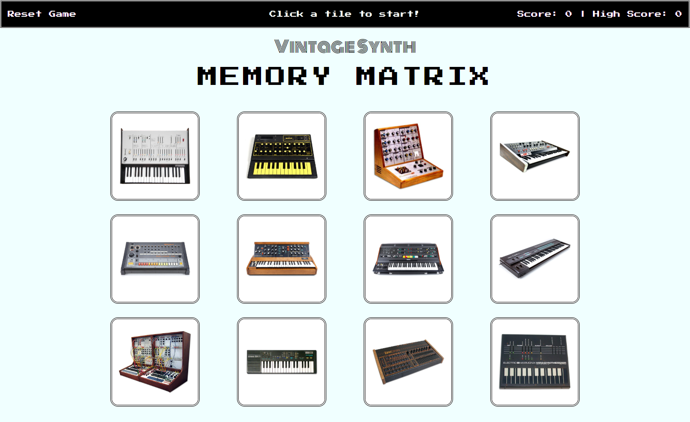

# Vintage Synth Memory Matrix
## UNC Coding Bootcamp React.js Homework  2-1-2019

The deployed app can be viewed at:  https://zinc-glaze.github.io/memory-matrix/

This is a simple memory game that presents the user with 12 image tiles. The user must click each tile without clicking the same one twice. The tiles are rearranged after each click. The game keeps score of how many unique tiles the user has clicked and the high score from each session.  

The main purpose of this app is to practice creating a React app, composing multiple components, and managing state. It demonstrates ability with the following tools and techniques:
  * React.js for front-end framework, logic, and state management
  * CSS for UI design, layout, and animations
  * Javascript/JSX for app logic and interactive elements
  * Github for app deployment and hosting

Installation: MongoDB and required npm packages must be installed to run this app locally.

### Screenshots

